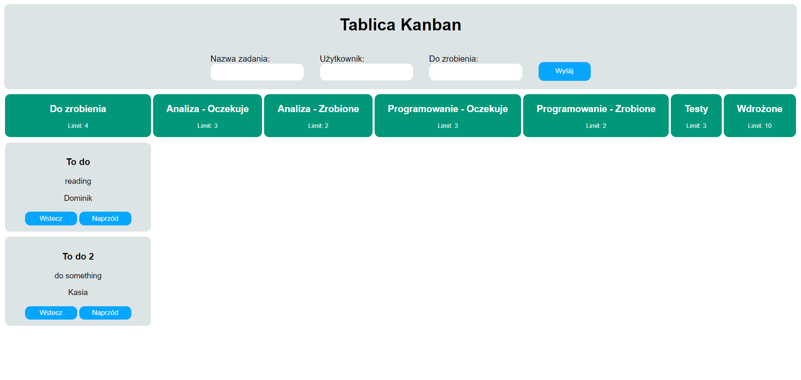

# Kanban Board

A kanban board is an agile project management tool designed to help visualize work, limit work-in-progress, and maximize efficiency (or flow), is used in many companies. More about Kaban [here](https://kanbanblog.com/explained/) In this repository I built a simple Kaban board The app uses modern React features including Hooks and Context API.

See the live version of [Kanban](https://domas-mo.github.io/Kanban/)

Project functionality: 
- create task with description;
- asign a person to the task;
- move tasks between columns with defined limits; 
- save tasks to local storage;
- clear tasks from the Local Storage.

**Main features**:
- React
&nbsp;
 
## 💡 Technologies


&nbsp;
 
## 💿 Installation

The project uses [node](https://nodejs.org/en/) and [npm](https://www.npmjs.com/). Having them installed, type into the terminal: `npm i`.
&nbsp;

## 🤔 Solutions provided in the project

1. Columns are rendered dynamically. The app follows the rules you specify.
```
export const columnList = [
  { id: 1, name: 'Do zrobienia', limit: 4 },
  { id: 2, name: 'Analiza - Oczekuje', limit: 3 },
  { id: 3, name: 'Analiza - Zrobione', limit: 2 },
  { id: 4, name: 'Programowanie - Oczekuje', limit: 3 },
  { id: 5, name: 'Programowanie - Zrobione', limit: 2 },
  { id: 6, name: 'Testy', limit: 3 },
  { id: 7, name: 'Wdrożone', limit: 10 },
];
```

2. LocalStorage enables the app to store the data inside it. I created my custom hook called useStorage to handle data saving. 
```
const useStorage = () => {
    const setItem = (data, name = '') => {
      window.localStorage.setItem(name, JSON.stringify(data));
    };
  
    const getItem = (name = '') => {
      const retrievedObject = JSON.parse(window.localStorage.getItem(name));
      return retrievedObject;
    };

    return [getItem, setItem];
};
```
&nbsp;
 
## 🙋‍♂️ Feel free to contact me

Hi there! I am Domink! I am looking for my first professional experience in IT area in Warsaw.

Find me on...

<p align="center">
	<a href="https://github.com/domas-mo"></a>
	<a href="https://www.linkedin.com/in/dominik-mo/"></a>
    <a href="mailto:dominik.mozdzen1@gmail.com"></a>
</p>
&nbsp;

## 👏 Thanks / Special thanks / Credits

To my [Mentor - devmentor.pl](https://devmentor.pl/) - for providing me with this task and for code review.
